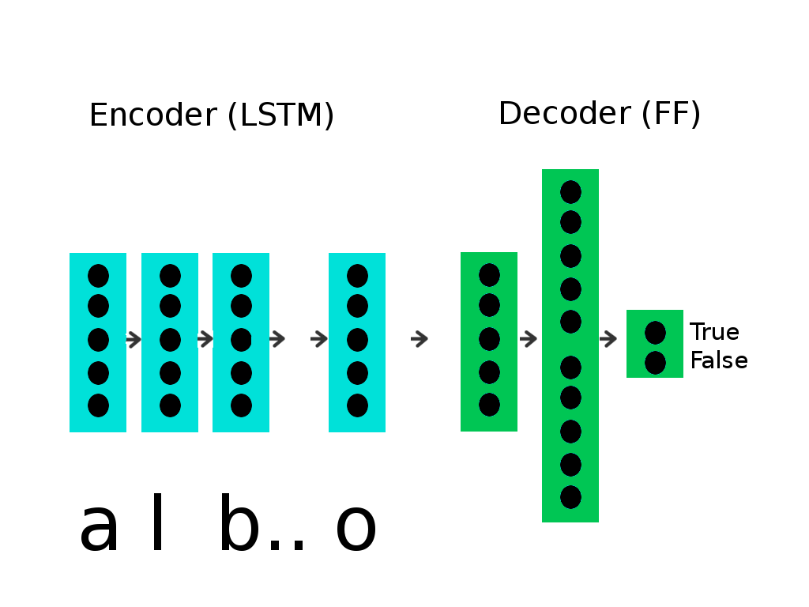

# What has to be done

The system is given a sentence ("The quick brown fox") and it must
determine if the sentence is the name of a person. I decided to use a
character based Neural Network approach to the problem


# Description of the model

The system implements an LSTM (2 layers) fed into a feedforward
network. The LSTM encodes the input sequence, while the feedforward
network tries to guess if the input is a person name or not.

The architecture of the network is as in the following picture



If the sequence of character is named as c_0, c_1, ... c_N, the
network tries to determine

P(is_person=True |c_0, c_1, ... c_N)

P(is_person=False|c_0, c_1, ... c_N)


# Technical specs

## LSTM
* internal memory dim = 512
* sequence_length = 32 for training, 128 for classification (with slight decrease in accuracy) 
* vocabulary size = 256

## Feedforward net
* 1st layer has the same size of the LSTM memory dim
* The second layer has twice that size
* The third layer is just a projection over two states

# Data used

The samples for people names are 1000 names chosen randomly from the
file you sent me. The examples of sentences that are *not* people
names are taken from [15000 useful
phrases](http://www.gutenberg.org/files/18362/18362.txt).

I limited the sample size at 1000 items for positive and negative
examples, due to time limitations. The corresponding training files
are
* data/train_names.txt
* data/non_names.txt

# Training

The data is fed to the network with alternating positive and negative
examples. Only 1000 element of each species (names and non names) have
been fed to the network.

During the training I limit the sequence length of the input to 32
characters. This was necessary because of time restrictions.

The training lasted for ~300 epochs. The cost function is
measured in terms of the cross entropy between the samples and the
results.

# Results

The network has been tested upon using another 1000 elements of each
species. The test files for the tests are

* data/test_names.txt
* data/test_non_names.txt

Upon using a sequence length of 32 character, the results are

```
Names classified correctly from the test set: 90.7%
Non names classified correctly from the test set: 94.3%
```

However, when loading the name classifier I decided to allow for a
longer sequence lenght: 128 characters. This is not the lenght used
for training, and the results are slighly worse.

```
Names classified correctly from the test set: 89.5%
Non names classified correctly from the test set: 93.5%
```

# How to use the classifier

The name of the model to load is 'model.nn'. It must be loaded as in the following

```python
from model import NameClassifier as Model

if __name__ == '__main__':
    model = Model.load('model.nn')

    lines = []
    lines.append('una rosa e per sempre')
    lines.append('alberto cetoli')
    lines.append('a limited avaibility')
    for line in lines:        
        print line, model.classify(line)

```

# How to improve the classifier

* With more time it would be possible to train it on more data
* Add more datasets to the list of possible non-names (possibly name of cities and events)
* Use the capital letters: all the strings are lower-cased in training and classification
* Use word embeddings instead of a character encoder